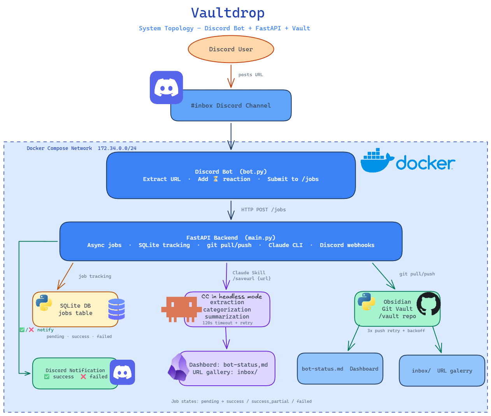

# Vaultdrop

A Discord bot + FastAPI service that saves URLs to a personal vault with automated metadata extraction using Claude AI.

## Overview

Vaultdrop is a distributed system that:
1. **Discord Bot** monitors a designated channel for URLs
2. **FastAPI Backend** processes URLs through Claude AI to extract and save content
3. Stores job metadata in SQLite and tracks processing status
4. Integrates with a Git-based vault repository for version control
5. Provides Discord notifications for successes and failures

## Architecture

```
Discord Channel
     ↓ (URL posted)
Discord Bot (discord-bot/)
     ↓ HTTP POST to /jobs
FastAPI Backend (fastapi/)
     ├─ SQLite jobs database
     ├─ Git pull/push with vault
     └─ Claude CLI integration
     ↓ (notification)
Discord Channel (status update)
```



<<<<<<< HEAD
> **Note**: The topology diagram is stored in this repository as a reference. If you need to customize the architecture diagram for your setup, regenerate it according to your system design and update the image path accordingly.

=======
>>>>>>> c8702fe1ae7e2a4e2775f6811cc7e426abab8f3c
## Directory Structure

```
vaultdrop/
├── discord-bot/          # Discord bot service
│   └── bot.py           # Listens for URLs in designated channel
├── fastapi/             # API & job processing service
│   └── main.py          # REST API + job processor
├── deploy/              # Deployment configuration
│   └── docker-compose.yml
├── .github/workflows/   # CI/CD pipeline
│   └── docker-build.yml
└── README.md
```

## Components

### Discord Bot (`discord-bot/bot.py`)
- **Purpose**: Monitors a Discord channel for URL messages
- **Triggers**: When a non-bot user posts a message in the inbox channel
- **Flow**:
  1. Extracts URLs from message content (first URL only)
  2. Adds hourglass reaction (⏳) to show processing
  3. Submits job to FastAPI `/jobs` endpoint
  4. Updates reaction based on response status

**Environment Variables**:
- `DISCORD_TOKEN`: Bot authentication token
- `FASTAPI_URL`: Internal FastAPI service URL
- `INBOX_CHANNEL_ID`: Discord channel ID to monitor (numeric)

### FastAPI Backend (`fastapi/main.py`)
- **Purpose**: Processes URLs and manages job lifecycle
- **Key Features**:
  - Async job processing with background tasks
  - SQLite job tracking (pending, success, failed states)
  - Git integration for vault synchronization
  - Claude CLI integration for content extraction
  - Discord webhook notifications

**Endpoints**:
- `POST /jobs` — Create a new processing job (returns job_id)
- `GET /jobs?limit=20` — List recent jobs

**Job Processing Flow**:
1. Create job record in database (pending status)
2. Git pull --rebase to sync vault
3. Run `claude --dangerously-skip-permissions -p "/save-url {url}"`
4. Parse frontmatter from generated markdown file
5. Update job status (success/success_partial/failed)
6. Generate `bot-status.md` report
7. Git commit + push with retry logic
8. Send Discord notification

**Database Schema** (`jobs` table):
- `id`: Short UUID (8 chars)
- `url`: Original URL to process
- `status`: pending | success | success_partial | failed
- `channel_id`, `message_id`: Discord references for notifications
- `title`, `category`, `tags`: Extracted metadata from frontmatter
- `error`: Failure reason (if failed)
- `created_at`, `completed_at`: Timestamps

**Environment Variables**:
- `DISCORD_TOKEN`: For sending Discord notifications
- `VAULT_PATH`: Mount point for vault repo (default: `/vault`)
- `DB_PATH`: SQLite database location (default: `/data/jobs.db`)

### Status Dashboard (`bot-status.md`)
- Auto-generated markdown file at `{VAULT_PATH}/00-inbox/bot-status.md`
- Contains recent job table with status icons:
  - ✅ `success`: Complete with metadata
  - ⚠️ `success_partial`: Saved but metadata incomplete
  - ❌ `failed`: Processing failed
  - ⏳ `pending`: Still processing
- Shows failed job details with error logs

## Deployment

### Docker Compose
Two containerized services running on internal bridge network (`172.34.0.0/24`):

```yaml
discord-bot:
  - Depends on: fastapi service
  - Restarts: unless-stopped
  - Env source: .env file

fastapi:
  - Mounts: /vault (read-write), .claude config (read-only)
  - Persistent volume: vaultdrop-data (for SQLite DB)
  - Restarts: unless-stopped
```

> **Note for forks**: The image paths in `deploy/docker-compose.yml` are hardcoded to the author's private GHCR registry (`ghcr.io/damianwojciechowski4/...`). If you fork this repo you must:
> 1. Update the `OWNER` variable in `.github/workflows/docker-build.yml` to your GitHub username.
> 2. Update both `image:` lines in `deploy/docker-compose.yml` to point to your own registry.
> 3. Push to `main` to trigger the CI build and populate your registry.

**Usage**:
```bash
cd deploy/
docker login ghcr.io -u {username} --password-stdin <<< $GITHUB_TOKEN
docker compose pull
docker compose up -d
```

### CI/CD Pipeline (GitHub Actions)
- **Trigger**: Push to `main` branch or PR to `main`
- **Jobs**:
  - `build-api`: Build and push `vaultdrop-api` image to GHCR
  - `build-bot`: Build and push `vaultdrop-bot` image to GHCR
- **Tags**: 
  - `latest` (on main push)
  - Git SHA (on any push)

## Processing Workflow

### Success Flow
```
URL in Discord
  ↓
Bot submits to /jobs
  ↓
FastAPI: git pull --rebase
  ↓
FastAPI: claude -p "/save-url {url}"
  ↓
Parse new .md file frontmatter (title, category, tags)
  ↓
Update job status = "success"
  ↓
git commit + push with retry
  ↓
Discord: "✅ Note added to library"
```

### Failure Handling
- **Claude timeout**: 120 second timeout with retry once after 5s
- **Git conflicts**: Auto-rebase with 3 push retry attempts (5s, 10s, 15s backoff)
- **Network errors**: Non-critical failures logged but don't block
- **Status tracking**: All failures recorded in jobs table and status dashboard

## Dependencies

**FastAPI Service**:
- `fastapi`, `httpx` (async HTTP)
- `pydantic` (request validation)
- `frontmatter` (YAML/markdown parsing)
- `sqlite3` (built-in)

**Discord Bot**:
- `discord.py` (bot framework)
- `httpx` (async HTTP client)

## Configuration

All configuration via environment variables in `.env` file:
- `DISCORD_TOKEN`: Required, bot token
- `FASTAPI_URL`: FastAPI service endpoint
- `INBOX_CHANNEL_ID`: Discord channel to monitor
- `VAULT_PATH`: Git vault repository path (default: `/vault`)
- `DB_PATH`: SQLite database path (default: `/data/jobs.db`)

## Development

To run locally (requires vault, Claude CLI, and Discord setup):
```bash
# FastAPI
cd fastapi/
pip install -r requirements.txt
export DISCORD_TOKEN=... VAULT_PATH=/path/to/vault
python main.py

# Discord Bot
cd discord-bot/
pip install -r requirements.txt
export DISCORD_TOKEN=... FASTAPI_URL=http://localhost:8000 INBOX_CHANNEL_ID=...
python bot.py
```

## Key Features

✅ **Async Job Processing** — FastAPI handles multiple URL submissions concurrently  
✅ **Git Integration** — Auto-sync and version control via pull/push  
✅ **Retry Logic** — Resilient to transient failures  
✅ **Status Tracking** — Complete job history with metadata in database  
✅ **Discord Notifications** — Real-time feedback on success/failure  
✅ **Containerized** — Docker Compose for easy deployment  
✅ **CI/CD Ready** — Automated image builds and registry push  

## License

MIT
